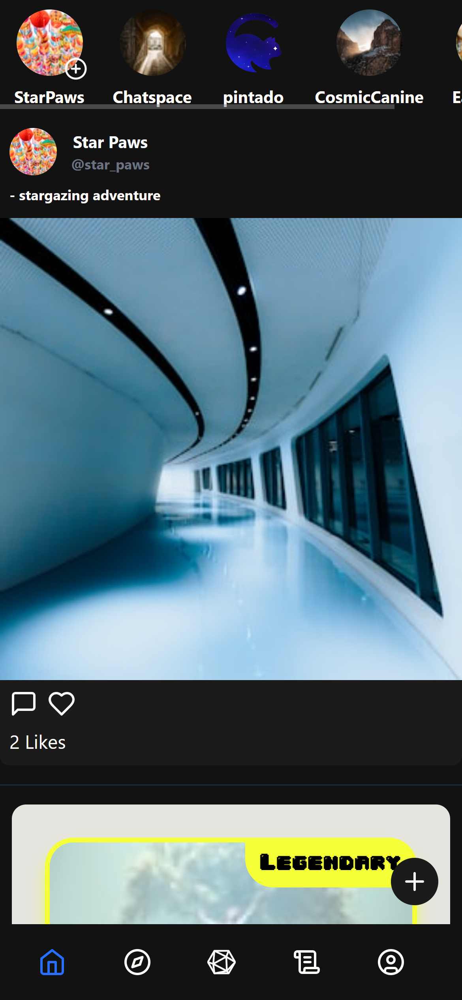
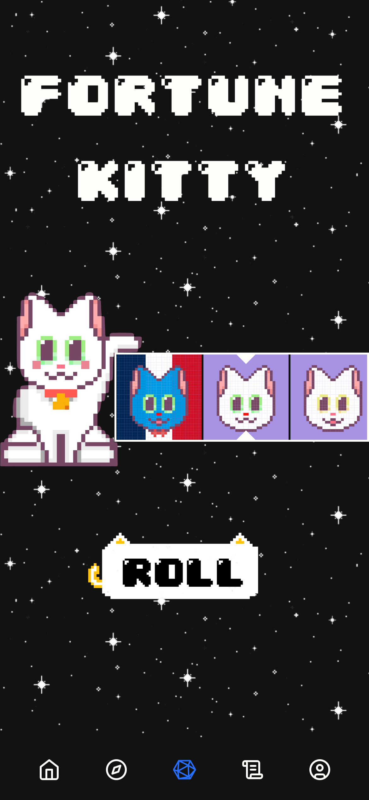

# Chatspace - Celestia's Infinite Space Bazaar Hackathon

## Basic Information
- *Project Name:* Chatspace
- *Project Team Members:* Daniel Yuki, Arthur Jacobina, Julia Fernandes, Lucas Fochesatto
- *Project Establishment Date:* 2024, May

## Overall Project Introduction
- *Project Background:*

   > "We love ..."

- *Project Introduction:*

  - Chatspace is a ...

- *Project Explanation:*

### Problem

The ... 

### Solution

...

### Technology Stack

- React.

- *Project Repos:*

[Frontend Repo](https://github.com/Celestia-Hackathon/frontend)

[Backend Repo](https://github.com/Celestia-Hackathon/backend)

[Contracts Repo](https://github.com/Celestia-Hackathon/contracts)

[Demo Repo](https://github.com/Celestia-Hackathon/Demo)

[Github Organization](https://github.com/Celestia-Hackathon)

- *Project Demo and Presentation:*

[Demo Link](https://chatspace-frontend.vercel.app/)

[Demo Video]()

[Presentation Link]()

- *Screenshots*

- *Project Logo:* 

## Items Completed For the Hackathon

- *Blockchain Side:*
      - [NFT-generator](https://github.com/Celestia-Hackathon/NFT-generator): It's the code in JS used for generating random combinations of a selected asset of layers that are used as the NFT's for the project.
      - [Tokens](https://github.com/Celestia-Hackathon/ERC721-ERC20): These are the contracts used for creating, minting and interacting with the CAT coin (a ERC20 token) and the NFT's (ERC721 tokens) deployed to OP Celestia Raspberry Testnet.

  - *Client Side:*
    - Web Owner Features:
      - Focused in the management of the tokens.
      - Withdraw funds from CATS trading.
      - Manage CATS to ETH rate.
      - Manage holdings and create proposals ('/my-holding' route)
    - *Web User Features:*
	- Buy NFT's in the marketplace ('/Marketplace' route)
	- Explore the social network. ('/ExploreHub' route)
	- Make posts. ('/NewMarketPlacePost' route)
	- Do quests to win CATS. ('/Quests' route)
Use the gatcha to win an NFT with no gas fees. ('/Gatcha' route)7
### Addresses

- Gelato:
   - NFTContractAddress deployed at:  [0x7164c48b7EA2acAa055FA1B8738ba5A4F7abeFca](https://opcelestia-raspberry.gelatoscout.com/address/0x7164c48b7EA2acAa055FA1B8738ba5A4F7abeFca)
   - catCoinContractAddress deployed at:  [0x04AD2aDd99df586E5236b0DA1EA2df1881E21662](https://opcelestia-raspberry.gelatoscout.com/address/0x04AD2aDd99df586E5236b0DA1EA2df1881E21662)

## Team Member Information
*Daniel Yuki*
 - Fullstack Developer & Team/Project Manager
 - Engineering student at ITA (Brazil), self-taught developer, president at university blockchain club and competed (and won) in several web2 and web3 hackathons
 - [Github](https://github.com/DanielYuki)

*Arthur Jacobina*
 - Head of Business
 - Engineering student at ITA (Brazil)...
 - [Github](https://github.com/Arthur-Jacobina)

*Lucas Fochesatto*
 - Frontend Developer &
 - Computer Engineering student at ITA (Brazil)...
 - [Github](https://github.com/lucas-fochesatto)

*Julia Fernandes*
 - Blockchain Developer
 - Computer Engineering student at ITA (Brazil)...
 - [Github](https://github.com/JFernandesLO)

